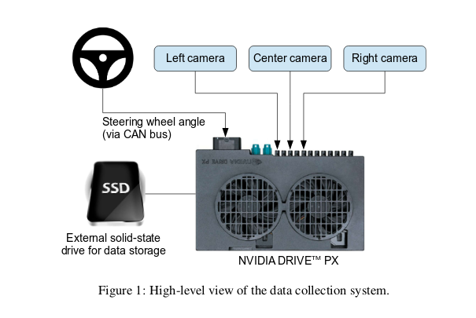
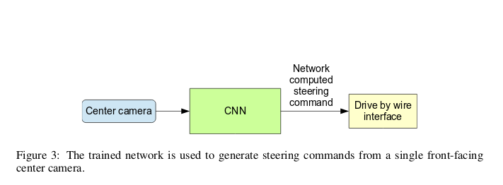
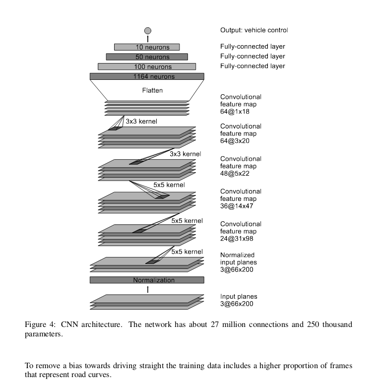
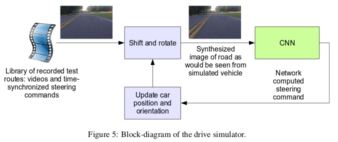
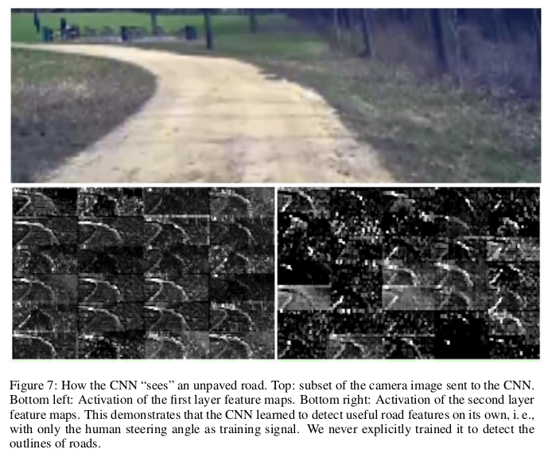
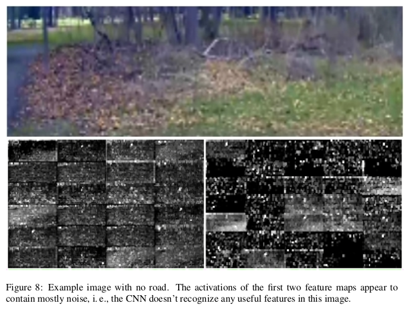

# Self Driving car using Deep Learning with Tensorflow.
This is an implementation of the research paper published by Nvidia a couple of years ago, with lots of changes. We will use a Convolution Neural Network architecture to train our model. We trained a convolutional neural network (CNN) to map raw pixels from a single front-facing camera directly to steering commands. This end-to-end approach proved surprisingly powerful. With minimum training data from humans the sys-tem learns to drive in traffic on local roads with or without lane markings and on highways. It also operates in areas with unclear visual guidance such as in parking lots and on unpaved roads. The system automatically learns internal representations of the necessary processing steps such as detecting useful road features with only the human steering angle as the training signal. We never explicitly trained it to detect, for example, the outline of roads. Compared to explicit decomposition of the problem, such as lane marking detection, path planning, and control, our end-to-end system optimizes all processing steps simultaneously. We argue that this will eventually lead to better performance and smaller systems. Better performance will result because the internal components self-optimize to maximize overall system performance, instead of optimizing human-selected intermediate criteria, e. g., lane detection.  Such criteria understandably are selected for ease of human interpretation which doesn’t automatically guarantee maximum system performance. Smaller networks are possible because the system learns to solve the problem with the minimal number of processing steps. The system operates at 30 frames per second (FPS).

# How to Use the model?
Download the [dataset](https://drive.google.com/file/d/18YHLAJqsZFYNH7spDt5z4Pcml8HpIn3l/view) from my google drive attachment and extract into the repository root folder

Use `python train.py` to train the model

Use `python run.py` to run the model on a live webcam feed

Use `python run_dataset.py` to run the model on the dataset

To visualize training using Tensorboard use `tensorboard --logdir=./logs`, then open http://0.0.0.0:6006/ into your web browser.

# High Level view of the data collection system.

# Training the Neural Network.

# How the trained network is used to generate steering commands?

# The neural network architecture.

# Block diagram of the drive simulator

# What we see vs what the CNN sees?

# Feature usefulness.

### Image References: NVidia Research
### Concept References: Srickant Verma (Applied AI Course)

